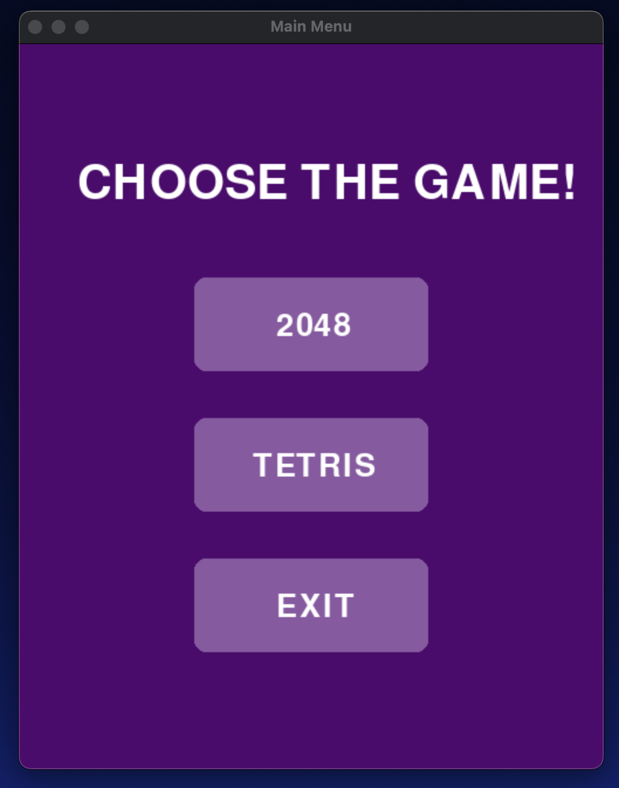
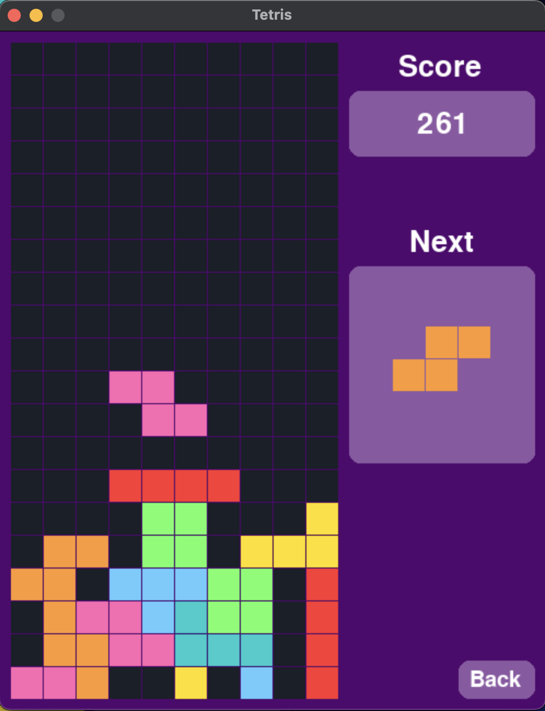
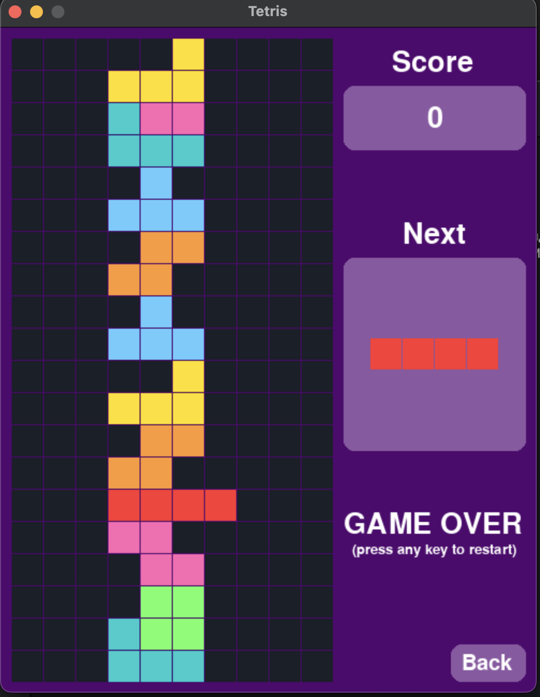
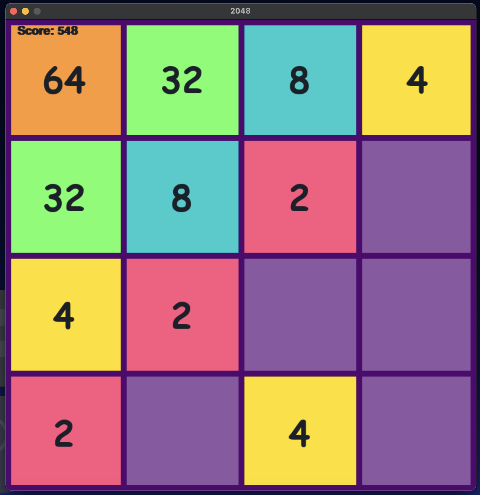
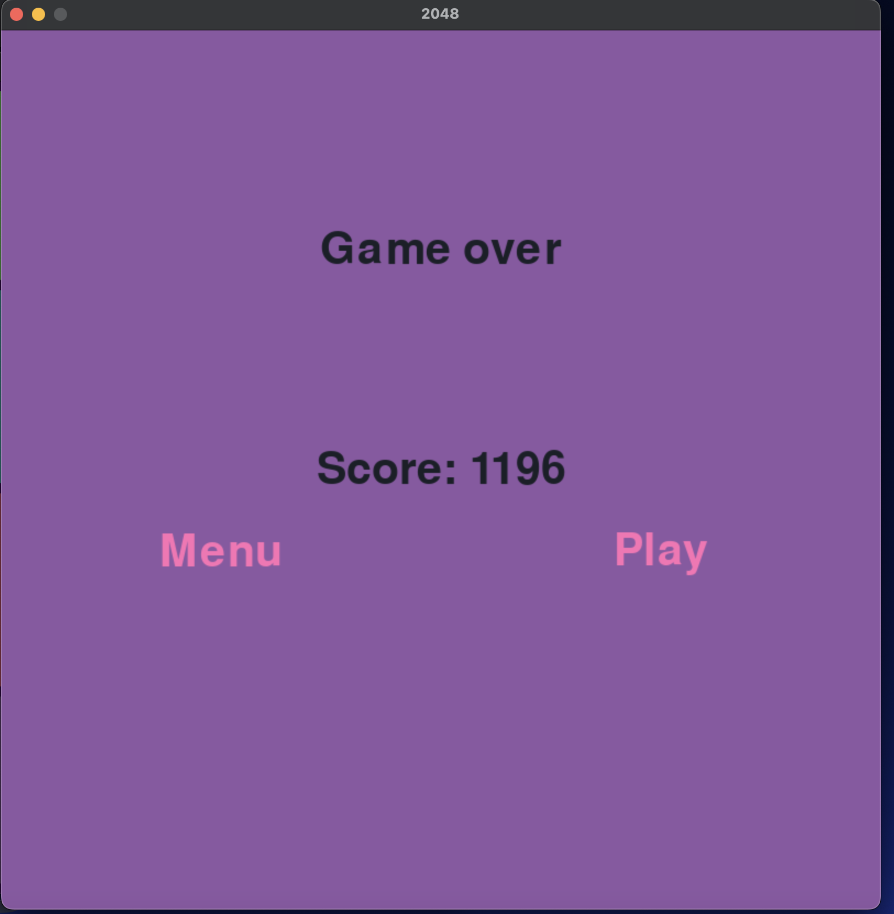

# Tetris & 2048 Games

A simple implementation of the popular games **2048** and **Tetris** using Python and Pygame. This game includes basic gameplay mechanics and a graphical user interface.

---

## Features
- **Graphical Interface:** A user-friendly interface using Pygame.
- **Game Over Screen:** Displays the final score and offers options to replay or return to the main menu.
- **Buttons:** Functional "Menu" and "Play" buttons on the end screen.

---

## Prerequisites
Ensure you have the following installed:

1. **Python 3.10 or higher**
2. **Pygame library**
   Install it via pip:
   ```bash
   pip install pygame
   ```
3. **pygame-ce library**  
   Install it via pip:
   ```bash
   pip install pygame-ce
   ```
---

## How to Run
1. Clone the repository:
   ```bash
   git clone https://github.com/vita133/GameDev.git
   ```
2. Run the game:
   ```bash
   python main_menu.py
   ```
---

## How to Play 2048
- **Move**: Use the **arrow keys** to slide the tiles across the board in any direction.
  - **Left Arrow**: Move all tiles to the left.
  - **Right Arrow**: Move all tiles to the right.
  - **Up Arrow**: Move all tiles upwards.
  - **Down Arrow**: Move all tiles downwards.
- **Objective**: The goal of 2048 is to combine tiles with the same number. To do this, keep sliding tiles to combine them and create higher values.
- **Game Over**: The game ends when there are no more valid moves available. Try to get the highest score possible before this happens!
- **Score**: Your score increases every time you combine tiles. Keep track of your progress and aim to reach 2048 or beyond for the best score!


## How to Play Tetris
- **Move**: Use the **arrow keys** to move the tetrominoes.
  - **Left Arrow**: Move the tetromino left.
  - **Right Arrow**: Move the tetromino right.
  - **Down Arrow**: Move the tetromino down faster.
  - **Up Arrow**: Rotate the tetromino to fit better in the grid.
- **Objective**: The goal is to complete horizontal lines without gaps. When a line is completed, it will increase your score.
- **Game Over**: The game ends when the tetrominoes stack up to the top of the screen and no more pieces can be placed. Press any key to restart the game.
- **Back to Main Menu**: You can return to the main menu by clicking the **Back** button located in the bottom-right corner of the screen.

## Screenshots





